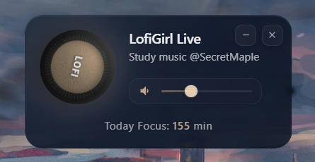

# Lofi Radio Player

**几乎所有手机都有灵动岛功能，也有大量的专注计时器软件，电脑为什么没有呢？**

* 这是一个基于 Electron 的桌面小部件音乐播放器，具有毛玻璃效果的精美 UI。
* 它可以永远挂在屏幕前台，提供学习计时功能。
* Lofi音乐被科学家认为是最适合专注工作学习的音乐类型。LofiGirl电台也在全球拥有众多粉丝

## 功能特点

- **沉浸体验**：7x24 小时无限播放 Lofi 音乐（有助于专注工作学习的安静音乐）。
- **双形态切换**：
  - 普通模式：旋转发光黑胶唱片质感。
  - Mini 模式：仿灵动岛设计，小巧玲珑。
- **桌面陪伴**：可以挂在屏幕上的任何地方，安静陪伴不打扰。
**- 快捷键：ALT + Q 一键暂停/播放音乐**

## 界面展示：普通模式 & Mini模式 自由切换！

## 界面展示

| 普通模式 (Normal Mode) | Mini 模式 (灵动岛风格) |
| :---: | :---: |
|  |  |
|  |  |
| *黑胶唱片质感* | *小巧玲珑，不占空间* |

---
## 你为什么要做这个？为什么不用 QQ 音乐？

因为你要的不是「听歌」，  而是「专注」。

- **无限专注，而不是循环歌单**

  7×24 小时自动播放 **不重复** 的 Lofi 音乐  
  > QQ 音乐 / 网易云采用歌单逻辑。歌曲有限（200–300 首）很快就会听腻
>

- **随时可控，而不是手动操作**

  全局快捷键**ALT+Q**  一键暂停 / 恢复  
  > 不需要切回浏览器 ，专注不中断

>

- **即开即用，而不是环境负担**

  不翻墙，不用去Youtube和Spotify，也能听到 LofiGirl Radio  
  > 任意一台联网电脑 打开就能用

>

- **没有画面，才是真正的专注**

  没有动画，没有弹幕，没有干扰  
  > 你不是来“消费内容” 也不是来看LofiGirl的写字女孩动画的  
  > 你是来把事情做完的
>
---
- **弥补市场空缺：** **学习APP和音乐APP为什么不能放在一起？**

  既然来听专注音乐，本质目的就是专注  
  > 那为什么不顺手做一个  
  > 类似 Forest / 番茄 To Do 的学习计时器？

>

- **弥补市场空缺：** **电脑上为什么不能有灵动岛？**

  灵动岛是一个很好的交互设计，但它只存在于手机上  
  > 如果把播放器 + 计时器 ，塞进一个电脑端的小胶囊  
  > 这件事本身就很有想象力

---
 AI 已经成为 Web3 求职的关键能力。
 
 ETH Bruce老师说过：在未来，用和不用AI的人，将成为两个物种
- **贴近真实需求，而不是造玩具**

  > 这是一次完整的 Vibe Coding 产品实践  
  > 从想法到落地，而不是只在黑客松写 Demo
>
- **系统性训练，而不是单点学习**
  
  > 做项目可以同时练习：Debug 能力 + UI / UX 设计能力 + 产品思维与用户视角。写一个清晰的Readme也是一个重要技能。
>
- **把结果留下来，而不是只写代码**
  
  > 用一份结构清晰的 README.md  
  > 记录设计决策、权衡与思考

---

## 关于我 Secret： Web3 实习计划学员 (ETH Panda/LXDAO) 

- 推特：[@SecretMaple24](https://twitter.com/SecretMaple24)
- TG：https://t.me/SecretZ24

### 过往经历
* 前大厂**财务计划分析**实习生 / 会计师事务所审计助理
* B站**220 万播放量** 游戏区频道，作品获游戏行业从业者普遍认可
* 独立设计美术虚拟产品并上架微信 **我做的虚拟产品被使用超 22 万次**
* 完全从 0 到 1 创建电商品牌，全流程单干，3 个月 GMV 破万，单日最高 1000+ 订单
* 做过10+数据分析项目，会写Python/SQL，现在在Dune练习Web3数分(SQL取数，搭Dashboard等）曾经参加过很多数学建模/数据分析高校竞赛
 
---

点个 **Star（收藏）** 支持一下，谢谢谢谢谢谢蟹蟹。求求了