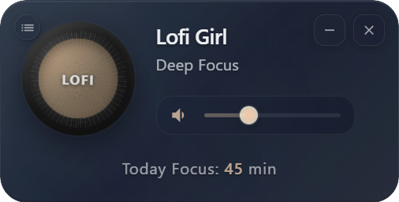

# Lofi Radio Player

**[点击这里下载 Windows / macOS](https://github.com/labilio/lofi-radio/releases/latest)**


**几乎所有手机都有灵动岛，也有大量的专注计时器软件，电脑为什么没有呢？**

## 🎵 简介

这是一款精简小巧的桌面音乐播放器，挂在屏幕上，**就像把咖啡店的背景音乐搬进你的书房。**

- **两种模式**：黑胶唱片 / 灵动岛风格，想安静挂着时就切成小胶囊
- **21 种电台**：Lo-fi、Chill、Jazz、古典、雨声……学习和工作时总能找到合适的一档
- **无限不重复**：播放的是 7×24 小时在线电台，不是听几遍就腻的固定歌单
- **全局快捷键**：随时播放暂停、隐藏窗口，不用离开正在做的事
- **专注计时**：顺手记录今天真正专注了多久

## 🖼️ 界面展示

| 普通模式 | Mini 模式（灵动岛风格） |
| :---: | :---: |
|  |  |
| *黑胶唱片质感，电台和音量一眼可见* | *小巧玲珑，不占空间* |

## ⬇️ 下载与安装

**[前往 Releases 下载最新版](https://github.com/labilio/lofi-radio/releases/latest)**

如果下载页里文件比较多，按你的电脑选择：

| 你的电脑 | 选择这个文件 | 更新方式 |
| --- | --- | --- |
| Windows 10 / 11（x64） | 文件名带 `Setup` 的 `.exe` | **推荐**。安装后可在应用内直接下载并升级 |
| Apple 芯片 Mac（M1 / M2 / M3 / M4…） | `mac-arm64.dmg` | 应用会提醒新版本，点击后前往下载页安装 |
| Intel 芯片 Mac | `mac-x64.dmg` | 应用会提醒新版本，点击后前往下载页安装 |

> 💡 **macOS 用户提示**：首次打开时，如果系统拦截应用，请右键点击应用并选择“打开”，或前往系统设置允许运行。

Windows 安装版每次打开后会自动检查一次更新。发现新版本时，直接在应用里下载，完成后点击“重启并安装”即可，不需要再手动去 GitHub 找安装包。

macOS 版本也会自动检查新版本，但目前需要前往下载页手动安装。这样做可以避开未签名应用直接自更新带来的系统拦截，稳妥一些。

## ✨ 功能特点

- **沉浸体验**：7×24 小时无限播放，超级适合学习、写作、编码和安静工作
- **轻量设计**：仅 120 MB+，无需复杂配置，下载后打开即可收听**无限不重复**的专注音乐
- **双形态切换**：
  - 普通模式：旋转发光的黑胶唱片质感
  - Mini 模式：仿灵动岛设计，缩成一个安静的小胶囊
- **全局可自定义快捷键**：
  - 播放 / 暂停：默认 `Alt + Q`（Windows）/ `Option + Q`（macOS）
  - 显示 / 隐藏：默认 `Alt + W`（Windows）/ `Option + W`（macOS）
  - Windows 在右下角系统托盘打开设置；macOS 在顶部右侧菜单栏打开设置
- **专注计时**：记录今日专注时长，每日自动重置
- **记住偏好**：自动记住上次选择的电台，下次打开继续播放
- **开机自启**：安装版可在设置中开启，打开电脑就有熟悉的背景音乐
- **一键静音**：点击小喇叭即可静音
- **自动检查更新**：每次打开检查一次；跳过某一版本后，下一个新版本仍会再次提醒

## 💡 你为什么要用这个？

### 不是在「听歌」，而是在「营造环境」

打开它，就像走进一家安静的咖啡店。

> 只有音乐，没有歌词，没有弹幕，没有干扰
>
> 你是来把事情做完的，不是来消费内容的

### 21 种电台，而不是一个歌单

7×24 小时自动播放，**无限不重复**。

> QQ 音乐 / 网易云是歌单逻辑，听完容易腻
>
> Lo-fi、Jazz、古典、雨声和更多风格，总有一档适合你当下的状态

### 随时可控，一键暂停

`Alt + Q`（Windows）/ `Option + Q`（macOS）

> 不需要切出窗口，专注不中断

### 即开即用，不设门槛

**不翻墙**，不用 YouTube / Spotify。

> 任意一台联网电脑，打开就能用

### 精简小巧，才是真正的沉浸

没有歌词滚动，没有 MV，没有社交功能。

> 一个小部件挂在屏幕上，安静陪伴
>
> 像咖啡店的背景音乐那样自然存在

### 学习 APP 和音乐 APP，为什么不能放在一起？

既然来听专注音乐，本质目的就是专注。

> 那为什么不顺手做一个
>
> 类似 Forest / 番茄 To Do 的学习计时器？

### 电脑上为什么不能有灵动岛？

灵动岛是一个很好的交互设计，但它只存在于手机上。

> 如果把播放器 + 计时器塞进一个电脑端的小胶囊
>
> 这件事本身就很有想象力

## 📻 电台列表

目前内置 21 个电台。平时直接在播放器左上角切换即可；想看完整名单，可以展开下面的表格。

<details>
<summary><strong>展开查看全部 21 个电台</strong></summary>

| 电台 | 风格标签 | 适用场景 | 特点 |
| --- | --- | --- | --- |
| **Lofi Girl** | Lo-fi / Hip-Hop | 学习 | 熟悉的 Lo-fi 直播氛围 |
| **Lofi Box** | Lo-fi | 学习 | 轻松稳定的学习背景音乐 |
| **Chill Wave** | Chillwave | 放松 | 带一点电子感的舒缓氛围 |
| **Groove Salad** | Downtempo / Ambient | 工作 | 节奏克制，适合长时间专注 |
| **ASP** | Ambient / Beat-free | 助眠 | 没有明显鼓点，适合放空 |
| **Paradise** | Mellow / Eclectic | 放松 | 曲风丰富但整体柔和 |
| **Drone Zone** | Drone / Ambient | 助眠 | 持续低音和深度环境声 |
| **Rain Sounds** | Rain / Thunderstorm | 助眠 | 自然雨声与雷雨白噪音 |
| **Jazz Box** | Jazz | 阅读 | 柔和爵士 |
| **Jazz Groove** | Jazz / Laid-back | 工作 | 有律动但不抢注意力 |
| **Jazz Smooth** | Jazz / Soul | 工作 | 轻柔顺滑的爵士氛围 |
| **Swiss Classic** | Classical | 学习 | 古典与交响乐 |
| **BBC 3** | Classical / Jazz | 探索 | 古典、爵士和艺术节目 |
| **Rap** | Hip-Hop / Rap | 运动 | 节奏更强，适合需要提神时 |
| **KEXP** | Rock / Eclectic | 探索 | 独立音乐与多元曲风 |
| **FluxFM ChillHop** | Chillhop / Lo-fi | 学习 | Lo-fi 与 Hip-Hop 的轻松结合 |
| **FluxFM Chillout** | Chillout | 工作 | 平稳舒缓的放松音乐 |
| **Chillsynth FM** | Chillsynth / Synthwave | 工作 | 夜晚感的合成器氛围 |
| **Lofi Mix** | Lo-fi / Lounge | 工作 | Lo-fi 与 Lounge 混合播放 |
| **Lofi Study** | Lo-fi / Chillout | 学习 | 为长时间学习准备的安静节奏 |
| **Loungetunes** | Jazzhop / Chillhop | 阅读 | 爵士与 Chillhop 的轻松融合 |

</details>

## 📝 更新日志

每个版本的新功能、修复内容和安装包都放在 [GitHub Releases](https://github.com/labilio/lofi-radio/releases)。

Windows 用户可以在屏幕右下角系统托盘处右键点击图标进入菜单；如果没有看到，请检查 `^` 隐藏图标区域。macOS 用户在屏幕顶部右侧菜单栏点击图标即可。

## 🤝 开源贡献

### 多电台切换功能 - [@WEP-56](https://github.com/WEP-56)

设计了多电台切换功能，包括：

- 电台列表界面（点击左上角按钮展开）
- 多电台配置与流媒体播放支持
- HTML5 Audio + HLS.js 播放器架构
- 电台偏好记忆功能

### macOS 支持 - [@0xBrick-Li](https://github.com/0xBrick-Li)

- 代码适配：快捷键 `Option + Q`、全局快捷键跨平台兼容
- 构建配置：DMG 安装包、macOS 打包配置

[@0xBrick-Li](https://github.com/0xBrick-Li) - Web3 实习计划学员（ETH Panda / LXDAO）

## 📈 Star History

Lofi Radio 于 2026.05 正式突破 200+ Stars！真的非常感谢大家的支持！

<a href="https://www.star-history.com/?type=date&repos=labilio%2Flofi-radio">
 <picture>
   <source media="(prefers-color-scheme: dark)" srcset="https://api.star-history.com/chart?repos=labilio/lofi-radio&type=date&theme=dark&legend=top-left&sealed_token=jOEjaBlJiJwjo_kKB5VJKI5jaalzXTI67J3_3NEa8Dctsl66ntE4ZVgp2vtTfymH9b2g4n-eqkrllpzhcx6UPPjur-hlTKcH4Kcr8OYmOIbhQzWmgE2yN3CSwrfOUsjSL7VIIQ8raY0dNHn7EmfyRQ5w7otxvenC1X4jrzLI4iNQDkJWAbki1TgyEul8" />
   <source media="(prefers-color-scheme: light)" srcset="https://api.star-history.com/chart?repos=labilio/lofi-radio&type=date&legend=top-left&sealed_token=jOEjaBlJiJwjo_kKB5VJKI5jaalzXTI67J3_3NEa8Dctsl66ntE4ZVgp2vtTfymH9b2g4n-eqkrllpzhcx6UPPjur-hlTKcH4Kcr8OYmOIbhQzWmgE2yN3CSwrfOUsjSL7VIIQ8raY0dNHn7EmfyRQ5w7otxvenC1X4jrzLI4iNQDkJWAbki1TgyEul8" />
   
 </picture>
</a>

## 🛠️ 技术栈

- Electron - 跨平台桌面应用框架
- HTML5 Audio + HLS.js - 流媒体播放
- CSS3 - 毛玻璃效果与动画

## 🚀 本地运行

```bash
git clone https://github.com/labilio/lofi-radio.git
cd lofi-radio
npm install
npm start
```

*欢迎提交 Issue 和 Pull Request！欢迎大家与我沟通！*

*如果你也喜欢的话，欢迎点亮右上角的 **Star（收藏）⭐** 支持一下！这个对我很有帮助！*
